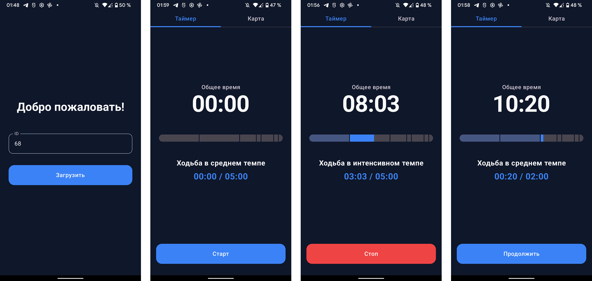

# Interval Workout App (Demo)

Демонстрирует реализацию таймера, работающего в фоне.

Проект написан на **Kotlin** с применением **Clean Architecture** и паттерна **MVVM**.

*   Jetpack Compose (Material 3, Theming, Dark/Light theme support).
*   Single Activity, Navigation Compose, Repository.
*   Dagger Hilt.
*   Kotlin Coroutines, Flow.
*   Retrofit 2, OkHttp.
